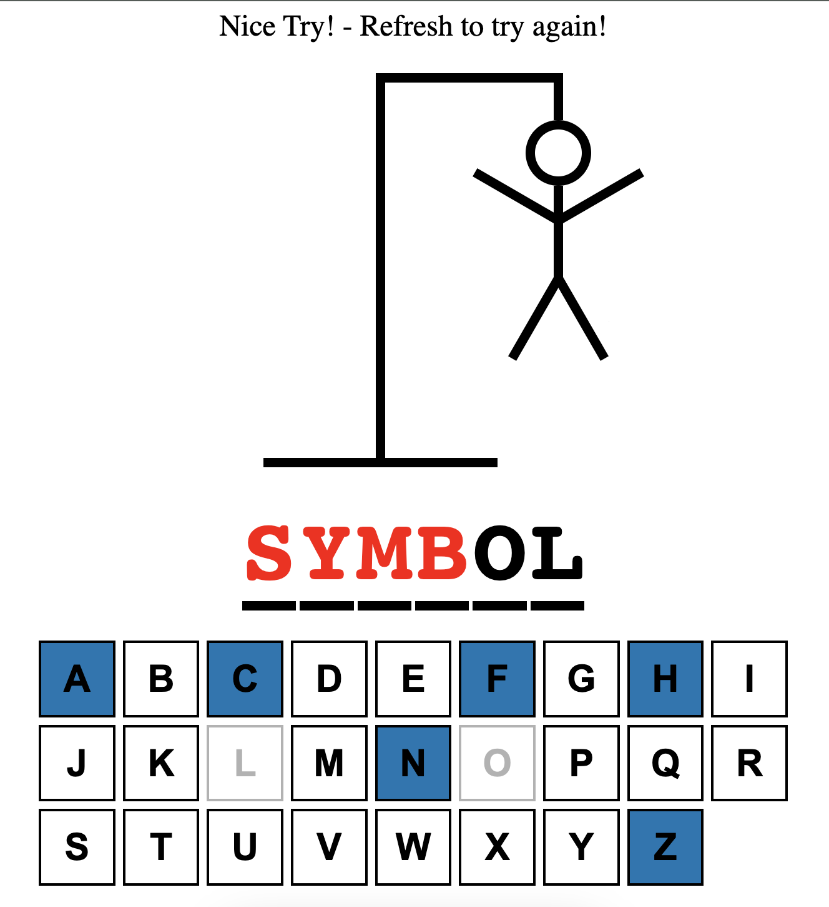
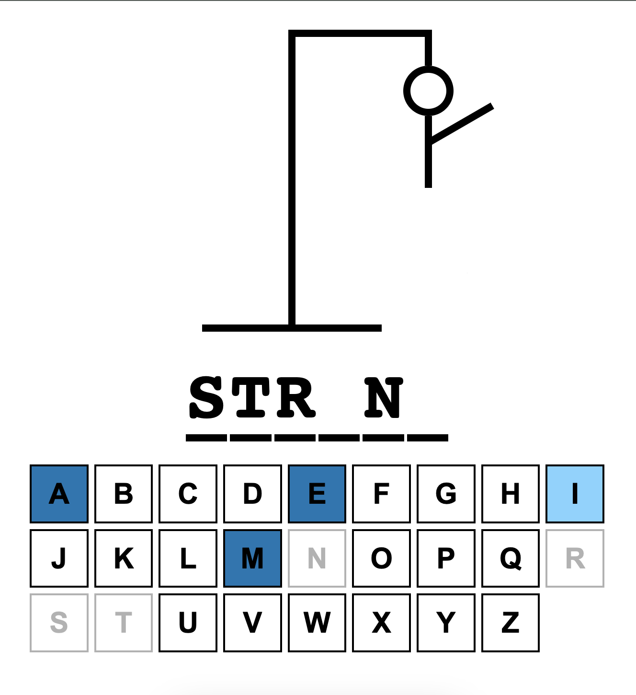
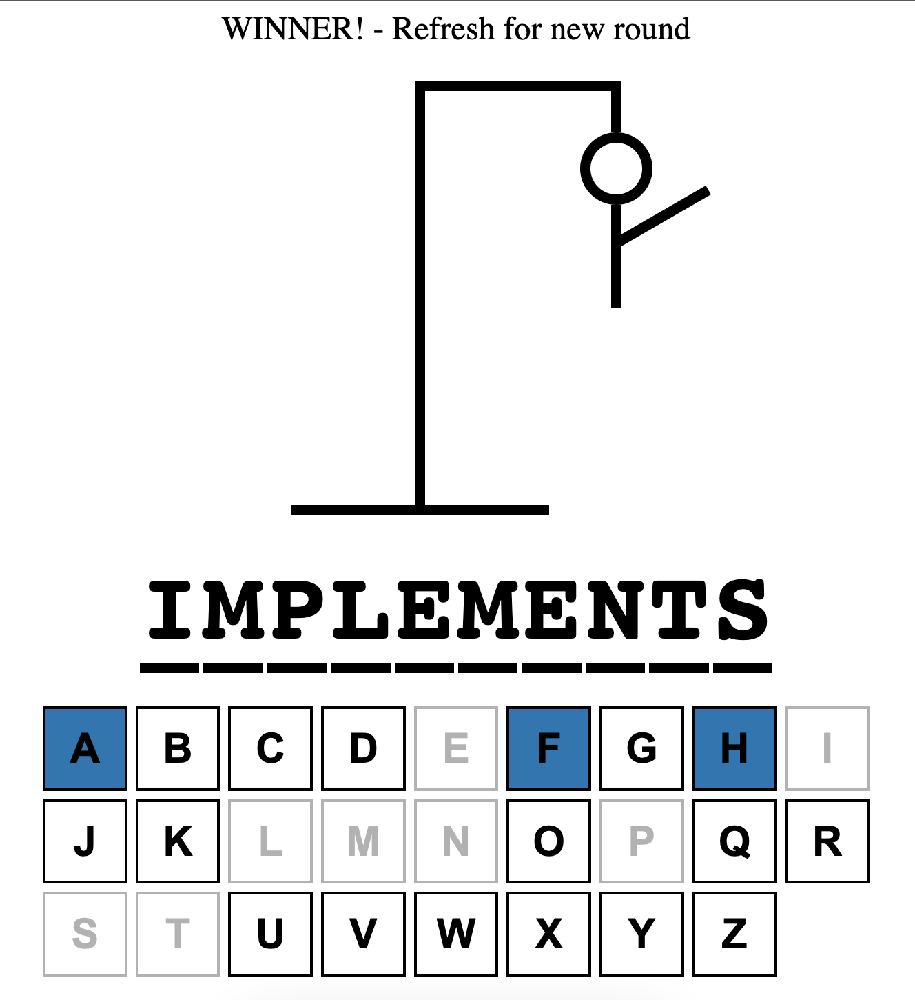

# Project Name: HANGMAN

Simple hangman game created by using React and Typescript.
Words are related to typeScript data types. such as;
"enum", "tuple", "constructor", "type", "alias", "keyof", "extends", "implements" etc

## Technologies Used

- React
- TypeScript
- Vite

## Screenshots

